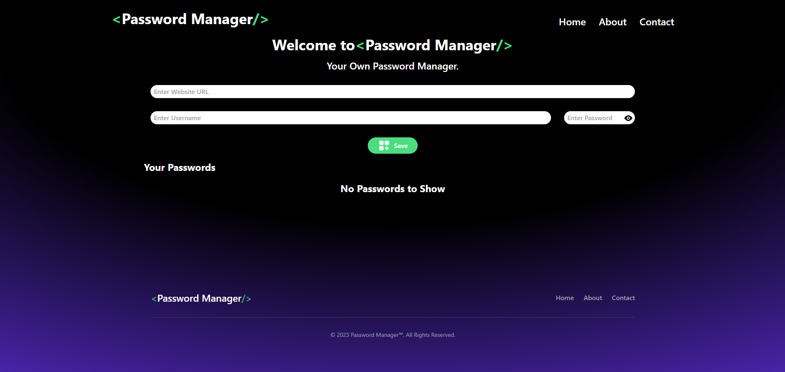

# About Password Manager

Welcome to Password Manager, your trusted companion in safeguarding your digital credentials. Developed with precision and care using React and styled with Tailwind CSS, Password Manager offers a seamless experience for managing your passwords securely.

## Our Mission

At Password Manager, we understand the critical importance of protecting your online identity. Our mission is to provide you with a user-friendly, yet robust solution that ensures your passwords remain safe from prying eyes while being easily accessible whenever you need them.

## Features

- **Secure Storage:** Your passwords are encrypted and stored locally using modern encryption standards, ensuring only you have access to them.
- **Effortless Management:** Easily save, delete, and edit your passwords with intuitive controls designed to streamline your experience.
- **Convenience:** Access your passwords anytime, anywhere, without the need for an internet connection. Your data stays with you, always.

## Why Choose Password Manager?

- **Privacy First:** We prioritize your privacy above all else. Your data is yours alone, and we never compromise on security.
- **User-Centric Design:** Our interface is crafted with your convenience in mind, making password management a breeze.
- **Reliability:** Built on robust technologies and tested rigorously, Password Manager ensures stability and dependability.

## About the Developer

Aarav Agarwal, the mind behind Password Manager, is passionate about empowering users with tools that enhance their digital security. With a background in software engineering and a commitment to excellence, Aarav strives to deliver solutions that make a difference.

## Get in Touch

Have questions, feedback, or suggestions? We'd love to hear from you! Feel free to reach out to me at [Github](https://www.github.com/AaravAgarwal05), and we'll get back to you as soon as possible. Thank you for choosing Password Manager to safeguard your digital life. Together, let's make the online world a safer place, one password at a time.

